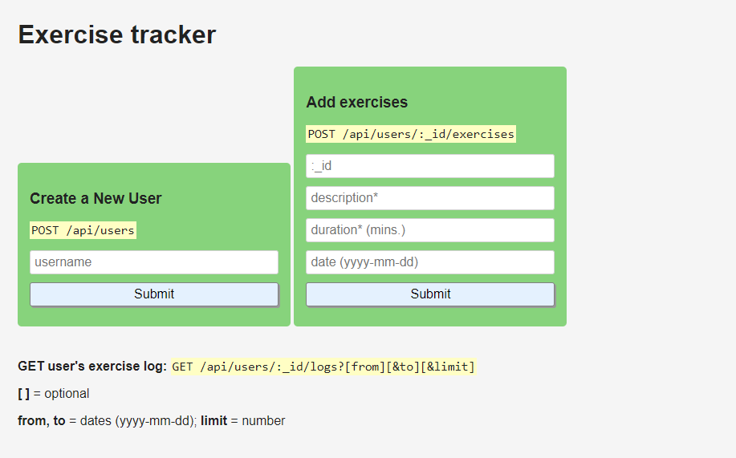

# API Exercise Tracker

 

## Assignment

Build a full stack JavaScript app that is functionally similar to this: https://exercise-tracker.freecodecamp.rocks. Working on this project will involve you writing your code using one of the following methods:

Clone this GitHub repo and complete your project locally.
Use our Replit starter project to complete your project.
Use a site builder of your choice to complete the project. Be sure to incorporate all the files from our GitHub repo.
If you use Replit, follow these steps to set up the project:

Start by importing the project on Replit.
Next, you will see a .replit window.
Select Use run command and click the Done button.

`
Exercise:

{
  username: "fcc_test",
  description: "test",
  duration: 60,
  date: "Mon Jan 01 1990",
  _id: "5fb5853f734231456ccb3b05"
}
User:

{
  username: "fcc_test",
  _id: "5fb5853f734231456ccb3b05"
}
Log:

{
  username: "fcc_test",
  count: 1,
  _id: "5fb5853f734231456ccb3b05",
  log: [{
    description: "test",
    duration: 60,
    date: "Mon Jan 01 1990",
  }]
}
`
Hint: For the date property, the toDateString method of the Date API can be used to achieve the expected output.

## Submitting

## Testing 
   --- > (Go to the link and press "Run")
